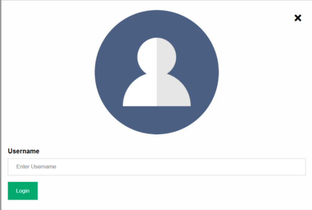

# Chat Application with Socket Programming

In this project, [socket.io](https://socket.io/) is used.

My heroku application link: https://chatappsocketprogramming.herokuapp.com/

## Welcome Page

## Login Page

## Main Page

## Message

## Emoji

## File

If you click sent file message, automatically the file is downloaded.

